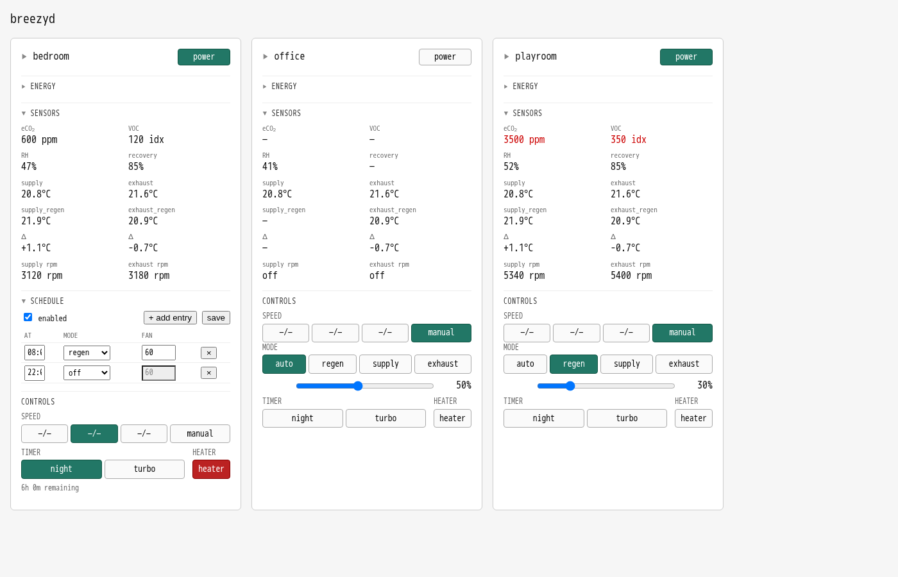

# breezyd

[](https://www.gnu.org/licenses/gpl-3.0)
[](https://pkg.go.dev/github.com/hughobrien/breezyd)
[](https://github.com/hughobrien/breezyd/releases)

A Go library, daemon, and CLI for controlling [Vents
Twinfresh](https://ventilation-system.com/) Breezy ductless heat-recovery
ventilators over the local network. It speaks the device's native UDP/4000
protocol directly — no cloud account, no MQTT broker, no vendor app, no Home
Assistant integration. LAN only.

The CLI works on its own — `breezy <name> <verb>` opens UDP to the
configured device and exits — and that's the default for a fresh install.
Add the optional daemon (`breezyd`) when you want polling, caching, a JSON
HTTP API, Prometheus `/metrics`, the embedded web dashboard, the HomeKit
bridge to Apple Home, or to serialize writes across multiple processes
against the same device.



The bundled web UI is one HTML file served from the daemon at `GET /`; auto-refreshes every 5 s, controls power/mode/speed/heater. See [Web UI](#web-ui) for details. The screenshot above is rendered automatically by `just screenshot` and re-committed when the design changes — the README always shows the current state.

### Supported devices

The same hardware ships under different model names depending on region. All
of these report unit type `0xB9 = 17` and speak the protocol this project
implements:

| Region        | Product name                                           |
|---------------|--------------------------------------------------------|
| Europe        | Vents Twinfresh **Breezy 160** (also Breezy Eco 160)   |
| North America | Vents Twinfresh **Elite 160 Pro** (ductless HRV)       |

The vendor's smaller and larger siblings (Breezy 200, Twinfresh Elite 200 Pro,
Breezy Eco 200) report different unit-type bytes (`20`, `22`, `24`) but use
the same wire protocol; this project should work against them although it has
only been tested against the 160 model.

## Status

Feature-complete for the operator's stated workflow. v1.0 shipped the
library + daemon + CLI + Prometheus surface; v1.1 added the embedded
web dashboard and the optional NixOS-nginx integration; v1.2 flipped
the CLI default to standalone (daemon is opt-in) and added the
`breezy param` registry lister; v1.3 added the optional HomeKit
bridge to Apple Home. See `CHANGELOG.md` for the per-version
breakdown.

In scope:
- Sensor metrics: humidity, eCO2, VOC, supply/extract/exhaust temperatures,
  fan RPMs, recovery efficiency, filter remaining time, motor lifetime, RTC
  battery, fault codes.
- Control: power, airflow mode (ventilation / regeneration / supply / extract),
  speed (preset 1-3 or manual 10-100 %), heater, filter timer reset, fault
  reset, RTC set.
- Per-device snapshots and Prometheus metrics.
- `breezy discover` for first-time bootstrap.
- Single-page web dashboard at `GET /` on the daemon, served from the
  same binary; auto-refreshes every 5 s; covers sensors, fans, service
  info, and the four high-level controls (power / mode / speed / heater).
- Optional HomeKit bridge: each Breezy appears in the Apple Home app
  with power, fan speed, supply/extract switches, and the full sensor
  surface (RH, eCO2, VOC, four temperatures).

Out of scope (see "Known limitations" below):
- No schedule editing. Scheduling is on-device and the CLI does not poke at it.
- No WiFi reconfig.
- No MQTT bridge or Home Assistant component.

Security caveat: the device leaks its protocol password and WiFi credentials in
cleartext to any LAN client that knows the device ID. Put these units on an
IoT VLAN. Details in the [Security](#security) section.

## Install

Pre-built binaries for Linux (amd64/arm64), macOS (amd64/arm64), and Windows
(amd64) are published on the [GitHub Releases
page](https://github.com/hughobrien/breezyd/releases). Download the archive
for your platform and extract `breezyd` and `breezy` somewhere on `$PATH`:

```sh
# Linux amd64 example
curl -sSL -o breezyd.tar.gz \
  https://github.com/hughobrien/breezyd/releases/latest/download/breezyd_Linux_x86_64.tar.gz
tar -xzf breezyd.tar.gz breezyd breezy
sudo install -m 0755 breezyd breezy /usr/local/bin/
breezyd --version
```

## Build from source

Requires Go 1.22+ (developed on 1.26). No other system dependencies for the
binaries themselves; the race-detector recipe (`just test-race`) needs a
working C toolchain.

```sh
just build       # produces ./breezyd and ./breezy
just check       # vet + fast tests (pre-commit gate)
just test-race   # full race-detector run (the CI command)
```

`just test-race` already sets `CGO_ENABLED=1 CC=clang`, so the recipe works
out of the box on dev hosts whose default `gcc` lacks the TSan runtime.

## Run with Nix

The repo is a Nix flake; if you have Nix with flakes enabled, you can run
either binary directly without cloning anywhere persistent or installing Go:

```sh
# Run the daemon (defaults to ~/.config/breezy/config.toml)
nix run github:hughobrien/breezyd

# Run the CLI (subcommands of `breezy`)
nix run github:hughobrien/breezyd#breezy -- ls
nix run github:hughobrien/breezyd#breezy -- playroom status

# Install both binaries into your user profile (lands them on $PATH).
# Faster than `nix run` for repeated use — that re-checks the flake on
# every invocation. Works on NixOS, nix-darwin, and any non-Nix host
# that has the Nix package manager.
nix profile install github:hughobrien/breezyd
breezy ls

# Build standalone binaries into ./result/bin/
nix build github:hughobrien/breezyd
./result/bin/breezyd --version

# Drop into a dev shell with Go, gopls, goreleaser, etc.
nix develop github:hughobrien/breezyd
```

The flake exposes three packages (`breezyd`, `breezy`, `default = breezyd`),
three apps (`default`, `breezyd`, `breezy`), a `devShells.default`, and a
`nixosModules.default` for running the daemon as a NixOS service.

### NixOS service

Four steps: add the flake input, discover your devices, configure the
module, rebuild and use it.

#### 1. Add the flake input + module import

```nix
{
  inputs.breezyd.url = "github:hughobrien/breezyd";

  outputs = { self, nixpkgs, breezyd, ... }: {
    nixosConfigurations.myhost = nixpkgs.lib.nixosSystem {
      system = "x86_64-linux";
      modules = [
        breezyd.nixosModules.default
        ./breezyd.nix         # the host-specific config from step 3
      ];
    };
  };
}
```

#### 2. Discover your devices

You need each unit's 16-character device ID before you can configure
it. Run discovery before the module is in place — `nix run` doesn't
need anything installed:

```sh
nix run github:hughobrien/breezyd#breezy -- discover
# 192.168.1.148  id=BREEZY00000000A0  type=17 (Breezy 160)
# 192.168.1.152  id=BREEZY00000000A1  type=17 (Breezy 160)
# 192.168.1.160  id=BREEZY00000000A2  type=17 (Breezy 160)
```

If your devices use a non-default password, add `-p PASSWORD` (some
firmware drops mismatched wildcard requests despite the spec).

If discover comes back empty but the units are reachable (Wi-Fi AP
isolation, separate VLANs, or a host firewall blocking UDP/4000 are
the common causes), pass each IP as a positional arg to send unicast
wildcards instead:

```sh
nix run github:hughobrien/breezyd#breezy -- discover -p huffpuff \
  192.168.1.148 192.168.1.152 192.168.1.160
```

Note the IDs and IPs — both go into the next step.

#### 3. Configure the module

```nix
# breezyd.nix
{
  services.breezyd = {
    enable = true;
    settings = {
      # Fleet-wide protocol password. Used for the daemon's wildcard
      # discovery probes and inherited by any device that doesn't set
      # its own.
      daemon.password = "huffpuff";

      # `ip` is optional — set it when broadcast is unreliable on your
      # LAN, and the daemon will skip discovery for that device.
      # Per-device `password` overrides `daemon.password`.
      devices.bedroom  = { id = "BREEZY00000000A0"; ip = "192.168.1.148"; };
      devices.office   = { id = "BREEZY00000000A1"; ip = "192.168.1.152"; };
      devices.playroom = { id = "BREEZY00000000A2"; ip = "192.168.1.160"; };
    };
  };
}
```

Inline `settings` render into a 0600 TOML at `/run/breezyd/breezyd.toml`,
but anything you put there ends up readable in the world-readable Nix
store. For real device passwords use `services.breezyd.configFile`
with sops-nix or agenix to point at a secrets-managed file instead.

#### 4. Rebuild and use it

After `nixos-rebuild switch`, the daemon starts and the `breezy` CLI
is on every user's PATH:

```sh
$ breezy ls
NAME      IP                  POWER  MODE          LAST POLL
bedroom   192.168.1.152:4000  on     supply        29s ago
office    192.168.1.160:4000  on     regeneration  29s ago
playroom  192.168.1.148:4000  off    extract       29s ago

$ breezy playroom status      # full snapshot
$ breezy bedroom speed manual:30
$ breezy office mode regeneration
```

If a row shows `?` for power / `never` for last poll, the daemon
hasn't been able to reach that device yet. Check the log:

```sh
journalctl -u breezyd -n 50 | grep -E 'discovery|no IP'
```

`discovery complete found=0` means the wildcard probe didn't get any
replies — go back to step 2 and add `ip = "..."` per device, which
bypasses discovery entirely.

#### What the module does

Creates a `breezyd` system user, runs the daemon under systemd with
hardening (`NoNewPrivileges`, `ProtectSystem=strict`, `PrivateTmp`,
`MemoryDenyWriteExecute`, etc.), starts after `network-online.target`,
and adds the `breezy` CLI to `environment.systemPackages` so it's on
every user's PATH. Set `services.breezyd.openFirewall = true` if you
bind the listener to a non-loopback address.

#### Prometheus (optional)

```nix
services.breezyd.prometheus.enable = true;
# Optional tunables, defaults shown:
# services.breezyd.prometheus.jobName = "breezyd";
# services.breezyd.prometheus.scrapeInterval = "30s";
```

Injects an entry into `services.prometheus.scrapeConfigs` only when
both `services.breezyd.enable` and `services.prometheus.enable` are
true.

#### HomeKit (optional)

```nix
services.breezyd.homekit.enable = true;
# Optional tunables, defaults shown:
# services.breezyd.homekit.port       = 0;          # 0 = ephemeral; pin if firewalling
# services.breezyd.homekit.bridgeName = "breezyd";  # name shown during pairing
# services.breezyd.homekit.stateDir   = "/var/lib/breezyd/homekit";
```

Each configured Breezy appears as a HomeKit accessory in Apple Home.
The module appends a `[homekit]` block to the generated config and
manages the state directory under `/var/lib/breezyd`. The pairing PIN
is auto-generated on first start and printed in the log; reset by
deleting the state directory. If `port` is non-zero and you want it
reachable from your phone, set `services.breezyd.openFirewall = true`
(opens the daemon's listener and the HomeKit port).

If you use `services.breezyd.configFile` (i.e. you manage the TOML
yourself with sops-nix / agenix), enabling `homekit` still adjusts the
systemd unit (state directory, firewall) but does **not** inject a
`[homekit]` block into your file — add it yourself.

## Getting started

The CLI works on its own — you only need the daemon if you want polling,
caching, the web dashboard, Prometheus metrics, or HomeKit. Most users
should start in standalone mode:

### 1. Find your device IDs

`breezy discover` broadcasts a wildcard request on UDP/4000. Each Breezy
that hears it answers with its 16-character device ID and unit type:

```sh
breezy discover
# 192.168.1.148  id=BREEZY00000000A0  type=17 (Breezy 160)
# 192.168.1.152  id=BREEZY00000000A1  type=17 (Breezy 160)
# 192.168.1.160  id=BREEZY00000000A2  type=17 (Breezy 160)
```

If broadcast comes back empty but you can `ping` the units (Wi-Fi AP
isolation, mesh hops, or separate VLANs commonly drop broadcasts while
unicast still works), pass the IPs as positional args — the CLI will
send the wildcard request unicast to each:

```sh
breezy discover 192.168.1.148 192.168.1.152 192.168.1.160
```

If that's *still* empty and you've changed the units off the factory
password, retry with `-p PASSWORD`. The vendor's spec says wildcard
discovery is unauthenticated, but some firmware versions silently drop
mismatched-password requests:

```sh
breezy discover -p testpwd 192.168.1.148 192.168.1.152 192.168.1.160
```

`-p` works with broadcast too (`breezy discover -p testpwd`), in case
your network is fine but only the password is the issue.

### 2. Write the config

Create `~/.config/breezy/config.toml` mode `0600` with one
`[devices.<name>]` block per unit:

```toml
[devices.playroom]
id       = "BREEZY00000000A0"
password = "testpwd"
ip       = "192.168.1.148"

[devices.bedroom]
id       = "BREEZY00000000A1"
password = "testpwd"
ip       = "192.168.1.152"

[devices.office]
id       = "BREEZY00000000A2"
password = "testpwd"
ip       = "192.168.1.160"
```

```sh
mkdir -p ~/.config/breezy
$EDITOR ~/.config/breezy/config.toml
chmod 0600 ~/.config/breezy/config.toml
```

The mode-0600 check is enforced — the loader refuses to start otherwise.

### 3. Verify

You're done. The CLI works:

```sh
breezy ls                          # all configured devices, one line each
breezy playroom status             # full snapshot — sensors, fans, service info
breezy bedroom speed manual:30     # set bedroom fan to 30 % manual
breezy office mode regeneration    # switch office to heat-recovery mode
```

`breezy --help` is the source of truth; see [CLI overview](#cli-overview)
for the full verb list.

### 4. (Optional) Run the daemon

Run `breezyd` if you want any of:

- **Polling + caching** — every device's state is refreshed on a configurable
  tick, served from memory. The CLI is faster and doesn't need the device
  to be reachable for every read.
- **JSON HTTP API** at `http://127.0.0.1:9876/v1/devices/...`.
- **Prometheus `/metrics`** for Grafana dashboards / alerts.
- **Embedded web dashboard** — the screenshot near the top of this README.
- **HomeKit bridge** — see the [HomeKit](#homekit-optional) section.
- **Concurrency safety** when multiple processes script `breezy` against the
  same device. Standalone CLIs don't coordinate with each other; the daemon
  serializes per-device UDP behind a mutex.

Add a `[daemon]` block to the config and start the daemon:

```toml
[daemon]
listen        = "127.0.0.1:9876"
poll_interval = "30s"
discovery     = "on-start"   # "on-start" | "off" | "periodic:<duration>"
```

```sh
breezyd                            # logs to stderr; stop with SIGINT/SIGTERM
```

The CLI auto-detects daemon mode when `[daemon].listen` is set in the
config or `--daemon URL` is passed. Override with `--daemon http://...`
to talk to a remote daemon, or omit `[daemon]` entirely to stay
standalone.

If the config doesn't exist when `breezyd` starts, it writes a sensible
default (with `[daemon]` commented out, so re-running gets you working
standalone immediately) and exits with an "edit it" message.

### 5. (Optional) Enable HomeKit

See the [HomeKit (optional)](#homekit-optional) section.

## Configuration reference

`~/.config/breezy/config.toml` — mode `0600` (loader enforces). Both daemon
and CLI read this file. The CLI uses `[daemon].listen` to decide whether
to talk HTTP to a daemon or UDP directly to each device, and reads each
`[devices.<name>]` for standalone-mode unicast targets.

Full schema with defaults:

```toml
# Optional. Without this block the CLI runs in standalone mode (no HTTP).
[daemon]
listen        = "127.0.0.1:9876"   # http listener; required when [daemon] present
poll_interval = "30s"              # default 30s
discovery     = "on-start"         # "on-start" | "off" | "periodic:<duration>"

# Optional. Off by default. See HomeKit section.
[homekit]
enabled = false
# bridge_name = "breezyd"
# port = 0                          # 0 = ephemeral
# state_dir = "~/.local/state/breezyd/homekit"

# One [devices.<name>] block per Breezy unit. Name = the label used as the
# CLI's <subject>: "breezy playroom status".
[devices.playroom]
id       = "BREEZY00000000A0"      # 16-char device ID; from `breezy discover`
password = "testpwd"               # protocol password
ip       = "192.168.1.148"         # required in standalone; optional in daemon mode
```

If you'd rather keep the config elsewhere (e.g. sops-nix / agenix), point
the daemon at it with `--config /path/to/file`. The mode-0600 check still
applies. The CLI's config path is fixed at `~/.config/breezy/config.toml`.

## Web UI

The daemon serves a single-page dashboard at the root path of its HTTP
listener:

```
http://127.0.0.1:9876/
```

Three columns of cards (one per configured device) showing live sensor
readings, fan RPMs, service info (filter, motor lifetime, RTC battery,
faults), firmware version, plus controls for the four high-level
options: power, airflow mode, speed (preset 1-3 or manual %), and the
auxiliary heater. The page auto-refreshes every 5 s; cards desaturate
when their last poll is more than 90 s old.

The default `[daemon].listen` is `127.0.0.1:9876`, which means the
dashboard is reachable only from the host running `breezyd`. To use it
from a phone or laptop on the same LAN, change the listener in
`~/.config/breezy/config.toml`:

```toml
[daemon]
listen = "0.0.0.0:9876"
```

(Or pick a specific LAN IP if you want to avoid binding on every
interface.) Restart `breezyd` after changing the config.

**Security implication:** the HTTP API has no authentication. Binding
to a LAN-reachable address exposes every `/v1/...` endpoint to anyone
on the same network — including the raw `POST /v1/devices/<name>/params/<id>`
write path that can change a unit's protocol password or WiFi
credentials. The mitigation is networking, not software: keep the
units (and the host running `breezyd`) on an IoT VLAN. See the
[Security](#security) section for the full picture.

### Behind nginx (NixOS)

If you're already running NixOS and `services.nginx`, the cleaner way
to expose the dashboard on the LAN is the module's opt-in nginx
integration: keep `[daemon].listen = "127.0.0.1:9876"` (so the daemon
itself stays loopback-bound and the raw API is unreachable from the
LAN), and let nginx be the network-facing service:

```nix
services.nginx.enable = true;
services.breezyd = {
  enable = true;
  nginx = {
    enable = true;
    virtualHost = "breezy.home.lan";
    # basicAuthFile = "/run/secrets/breezy-htpasswd";  # sops-nix / agenix
  };
};

# Define the vhost yourself — TLS, ACME, listen ports, etc. The module
# only adds the location."/" with proxy_pass + basicAuthFile.
services.nginx.virtualHosts."breezy.home.lan" = {
  forceSSL = true;
  enableACME = true;
};
```

This is the recommended path when the dashboard is reached from
devices other than the host running `breezyd`. Combined with
`basicAuthFile`, it gives you both transport-level (TLS, if you set
`forceSSL`) and application-level (basic auth) gates that the
direct-listen path lacks. The daemon's full `/v1/...` API remains on
loopback, so a compromised LAN device can't reach the raw param write
endpoint even after authenticating to nginx.

## HomeKit (optional)

The daemon includes an opt-in HomeKit bridge. When enabled, each
configured Breezy appears in the Apple Home app as one accessory
with power, fan speed, supply-only / extract-only switches, and the
full sensor surface (humidity, eCO2, VOC, four temperatures).

Enable it by adding to `~/.config/breezy/config.toml`:

```toml
[homekit]
enabled = true
```

Restart `breezyd`. The startup log includes a line like:

    homekit: bridge ready name="breezyd" pin="123-45-678" state_dir="..."

Open the Apple Home app on iPhone → Add Accessory → enter the PIN
manually. All configured Breezy units appear together; each gets
its own tile.

**Reset pairing:** delete the state directory (`~/.local/state/
breezyd/homekit` by default, `/var/lib/breezyd/homekit` on NixOS).
The next daemon start regenerates the PIN.

**Tunables** (all optional):

- `bridge_name`: name shown during pairing. Default `"breezyd"`.
- `port`: TCP port for the HAP server. Default 0 (OS-assigned).
- `state_dir`: where pairing keys + the PIN live.

On NixOS, enable the bridge via the module:

```nix
services.breezyd.homekit.enable = true;
# Optional tunables, defaults shown:
# services.breezyd.homekit.bridgeName = "breezyd";
# services.breezyd.homekit.port = 0;  # 0 = OS-assigned; set a fixed port if you need firewall rules
# services.breezyd.homekit.stateDir = "/var/lib/breezyd/homekit";
```

When `services.breezyd.openFirewall = true` and `homekit.port` is non-zero,
the module opens that port in the firewall automatically. Port 0 (ephemeral)
cannot be pre-opened; if you need a fixed firewall hole, set a specific port.

The HomeKit bridge always uses the daemon path — writes go through
`pkg/breezy/ops` with the same per-device mutex serialisation and fan-settle
window as the HTTP handlers. The standalone-CLI concurrency caveat is
unrelated; the HomeKit bridge never opens its own UDP socket.

## CLI overview

`breezy --help` is the source of truth. The shape is "subject before verb",
so per-device commands read naturally:

| Command                              | What it does                                 |
| ------------------------------------ | -------------------------------------------- |
| `breezy ls`                          | one-line table of every configured device   |
| `breezy discover [-p PWD] [ip...]`   | LAN broadcast (or unicast to each IP); `-p` overrides the wildcard discovery password |
| `breezy param`                       | list known parameters (id, type, unit, caps; use `name` with `get`/`set`) |
| `breezy playroom status`             | full structured snapshot                     |
| `breezy bedroom on` / `off`          | power                                        |
| `breezy bedroom speed manual:30`     | set fan to 30 % manual                       |
| `breezy bedroom speed 2`             | switch to preset 2                           |
| `breezy office mode regeneration`    | airflow mode (ventilation / regeneration / supply / extract) |
| `breezy office heater on`            | toggle the auxiliary heater                  |
| `breezy playroom faults`             | list active fault codes                      |
| `breezy playroom firmware`           | firmware version + build date                |
| `breezy playroom efficiency`         | recovery efficiency %                        |
| `breezy playroom rtc`                | show device clock                            |
| `breezy playroom rtc set 2026-05-03T22:00:00-07:00` | set device clock          |
| `breezy playroom reset-filter`       | clear the filter timer                       |
| `breezy playroom reset-faults`       | clear active fault flags                     |
| `breezy playroom get humidity`       | raw param read by name or hex                |
| `breezy playroom set 0x25 1e`        | raw param write (hex)                        |

The CLI exit codes are: `0` success, `1` backend error (HTTP envelope in daemon
mode, plain error message in standalone mode), `2` local usage error.

### Standalone vs daemon mode

The CLI defaults to standalone mode (UDP directly to each device). See
[Getting started](#getting-started) for the typical flow and when to
escalate to daemon mode.

**Concurrency caveat:** the daemon serializes per-device UDP behind a
mutex. Standalone CLI processes do not coordinate with each other —
two `breezy` invocations against the same device at the same instant
can produce silent checksum corruption. If you script invocations in
parallel against the same device, run the daemon and use the CLI in
daemon mode.

## Prometheus

The daemon exposes `/metrics` in Prometheus exposition format. Scrape it like
any other target:

```yaml
# prometheus.yml
scrape_configs:
  - job_name: breezy
    static_configs:
      - targets: ['localhost:9876']
```

Each metric is labelled with `device="<name>"` and `id="<16-char id>"`. A few
useful queries:

```promql
# Indoor temperature per device
breezy_temperature_celsius{location="indoor"}

# Any sensor over its alert threshold (humidity / co2 / voc)
max by (device) (breezy_sensor_alert) > 0

# Recovery efficiency, room by room
breezy_recovery_efficiency_pct

# Filter time remaining, in days
breezy_filter_remaining_seconds / 86400

# Has any device gone unreachable in the last 5 minutes?
time() - breezy_last_poll_timestamp > 300
```

`breezy_up{device="..."}` is `1` while the poller is reaching the unit and `0`
otherwise; the corresponding `breezy_last_poll_timestamp` is the unix time of
the last successful read.

## Project layout

```
breezyd/
├── pkg/breezy/                # protocol library (importable)
│   ├── frame.go               # FDFD/02 packet codec
│   ├── client.go              # UDP transport, retries, timeouts
│   ├── params.go              # parameter registry (id, type, R/W, units)
│   ├── values.go              # typed value codecs
│   ├── discover.go            # LAN broadcast
│   └── fakedevice/            # in-process protocol-speaking fake for tests
├── cmd/breezyd/               # the daemon (HTTP + Prometheus + poller)
├── cmd/breezy/                # the CLI (standalone UDP by default; daemon mode opt-in)
├── internal/config/           # TOML config loader, shared by both
├── tools/                     # Phase 0 Python probes (one-off, kept for reference)
└── docs/superpowers/specs/    # design doc, parameter map, vendor PDF manual
```

## Testing

```sh
just test                       # unit tests (uses fakedevice)
just test-race                  # same, with -race (the CI command)
just lint                       # go vet + gofmt-drift check
just check                      # lint + fast tests (pre-commit gate)
just check-all                  # check + test-race + Playwright UI suite
```

UI tests are end-to-end Playwright specs under `tests/ui/` that mock the
daemon's `/v1/...` endpoints via `page.route()` — no real `breezyd` needed:

```sh
just test-ui-install            # one-time: pnpm install + chromium download
just test-ui                    # 11 specs, ~3 s
just screenshot                 # re-render tests/ui/screenshots/*.png
```

Run a single Go package or test with raw `go`:

```sh
go test ./pkg/breezy/...
go test ./cmd/breezyd -run TestPoller_FanSettle
```

Live integration tests against real hardware are gated by both the
`integration` build tag and `BREEZY_INTEGRATION=1`, plus three env vars
identifying the target device. The `just test-integration` recipe wraps
all of that:

```sh
just test-integration 192.168.1.148 BREEZY00000000A0 <your password>
```

These tests write to the device — each one registers a `t.Cleanup` that
restores the prior value, so re-runs leave the unit in its original state.

## Security

The Breezy firmware will hand out its own protocol password (param `0x7D`),
the WiFi SSID (`0x95`), and the WiFi password (`0x96`) over UDP/4000 in
cleartext, to any client on the same broadcast domain that knows the
16-character device ID. Discovery is itself unauthenticated — anyone on
the LAN can enumerate every Breezy unit and read those parameters.

Mitigation is networking, not software: put the units on an IoT VLAN that
cannot reach the rest of your home LAN, and only allow the host running
`breezyd` into that VLAN. This project does not add cryptography on top of
the wire protocol — that would not change the threat model, since the
device firmware itself answers in cleartext.

The web dashboard at `GET /` lives on the same listener as the JSON API.
If you change `[daemon].listen` from the loopback default to a LAN
address so the dashboard is reachable from your phone, you also expose
the rest of the API — including raw parameter writes — to anyone on
that network. The same VLAN-segmentation recommendation applies: put
the host running `breezyd` on the IoT VLAN with the units, and reach
the dashboard from a workstation that is briefly granted access to
that VLAN, rather than binding `breezyd` to your trusted LAN.

## Known limitations

These are deliberate omissions, not bugs. Each is a design choice; see the
spec for the full rationale.

- **No schedule editing.** The device's seven-day schedule is on-board; the
  CLI exposes the live state but does not let you re-program it — the
  operator's stated workflow uses the unit's own buttons.
- **No WiFi reconfig.** Changing the WiFi SSID/password from the CLI is
  technically possible but operationally hazardous (one bad write strands the
  unit). Use the vendor app for this.
- **No MQTT bridge.** The HTTP API and Prometheus surface cover every use
  case the operator has so far. The state cache is shaped so a bridge could
  be added later without rewriting the core.
- **No Home Assistant integration.** Same reasoning. Anyone who wants HA
  integration can build a REST sensor on top of `/v1/devices/<name>` or
  scrape `/metrics`.

## Pointers to deeper docs

- `docs/superpowers/specs/2026-05-03-twinfresh-cli-design.md` — full v1 design
  doc: protocol decisions, daemon architecture, error semantics, status-line
  format, etc.
- `docs/superpowers/specs/2026-05-04-basic-ui-design.md` — design doc for the
  web dashboard, the bind-address tradeoff, and the optional NixOS-nginx
  reverse-proxy integration.
- `docs/superpowers/specs/2026-05-04-discover-investigation.md` — the two
  causes behind `breezy discover` failures (a code defect, fixed; and the
  QEMU-NAT environmental constraint, documented) with concrete next steps.
- `docs/superpowers/specs/2026-05-03-param-map.md` — every parameter ID the
  device exposes, with type, units, observed values, and notes from Phase 0
  characterization.
- `docs/superpowers/specs/breezy-manual-vendor.pdf` — vendor protocol manual,
  the authoritative reference for the wire protocol. Cached locally for offline
  reading; the canonical copy is published by Vents at
  <https://ventilation-system.com/download/breezy-manual-21433.pdf>.
- `docs/superpowers/specs/breezy-datasheet-vendor.pdf` — hardware datasheet.
  Canonical copy at
  <https://ventilation-system.com/download/breezy-datasheet-21437.pdf>.

## Credits

This project would not have been possible without the published protocol
documentation from **Ventilation Systems Ltd. (Vents)**. The Breezy / Breezy
Eco connection-instruction manual at
<https://ventilation-system.com/download/breezy-manual-21433.pdf> documents the
full wire protocol, packet structure, function codes, and parameter table that
this library implements. Reading the manual confirmed (and in places
corrected) the empirical reverse-engineering captured during Phase 0 of this
project. Thanks to Vents for publishing it openly.

The bundled copies of the manual and datasheet under
`docs/superpowers/specs/` are provided for convenience and remain © Vents.
Refer to the canonical URLs above for the latest versions.

## License

Copyright (C) 2026 Hugh O'Brien

This program is free software: you can redistribute it and/or modify it under
the terms of the GNU General Public License as published by the Free Software
Foundation, either version 3 of the License, or (at your option) any later
version (`SPDX-License-Identifier: GPL-3.0-or-later`).

This program is distributed in the hope that it will be useful, but WITHOUT
ANY WARRANTY; without even the implied warranty of MERCHANTABILITY or FITNESS
FOR A PARTICULAR PURPOSE. See the [LICENSE](LICENSE) file for the full text
of the GNU General Public License v3.

This project is not affiliated with or endorsed by Ventilation Systems Ltd.
"Vents" and "Twinfresh" are trademarks of their respective owners.
