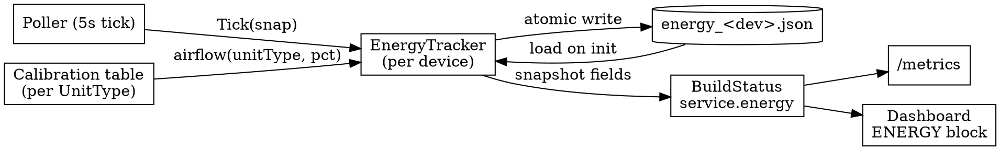

# Daemon-side Energy Recovery Tracking

## Goal

Show the user how much heating and cooling energy the HRV has recovered: a live wattage figure plus today and lifetime kWh totals, separated into heating-recovered and cooling-recovered. Track only while in regeneration airflow mode (the only mode where the heat exchanger is actually running). Add an ENERGY block to the dashboard at the bottom of each card; surface the same numbers in the JSON snapshot and on `/metrics`.

Concurrently: factor out the override-warning text (`⚠ timer active (night) — fan slowed`, sensor-override warnings) into a NOTICE block at the very bottom of the card. The warning currently lives inside the Speed control, where it competes with the active controls; a dedicated section makes notices the last thing the user sees.

## Architecture

The accumulator lives in the daemon, not in the UI. Three reasons:

1. **Survives reload.** A JS-only counter resets every time the user reopens the dashboard. A daemon counter persists in `state_dir` and resumes across daemon restarts.
2. **Single source of truth.** The HomeKit bridge, Prometheus scrape, and the dashboard all read the same numbers from the cached snapshot. No drift between surfaces.
3. **Tied to the poll cadence.** The poller already sees every state transition. Hooking the energy tick to the poll loop guarantees we never miss a sample, and gives us a natural `dt = time_since_last_tick` from the poller's own clock.



## Energy math

Per-tick instantaneous power, sensible only (HRV recovers no latent heat):

```
W = airflow_m³_per_h × 0.335 × supply_Δ_°C
  where 0.335 = ρ_air (1.2 kg/m³) × c_p (1005 J/(kg·K)) ÷ 3600 s/h
        supply_Δ = temp_supply_c − temp_outdoor_c
```

`airflow_m³_per_h` comes from the per-model calibration table evaluated at the current `fan_supply_pct`. Linear interpolation between table points, clamped to the table's domain.

Sign convention:

- `supply_Δ > 0`: heat recovered into incoming air (winter). Add `|W| × dt` to `heating_recovered`.
- `supply_Δ < 0`: heat dumped from incoming air (summer). Add `|W| × dt` to `cooling_recovered`.

The signed delta is the natural output of `temp_supply_c − temp_outdoor_c`; we just route it to the right counter based on sign. Both counters are non-negative — they represent "energy moved across the exchanger in this direction", which is always a saving (avoided heating in winter, avoided AC load in summer).

## Calibration table

Per-model airflow curve, hardcoded in the daemon. The `UnitType` (param `0x00B9`, also returned by Discover) keys the lookup. Curve points come from each model's published spec sheet; linear interpolation between adjacent points handles any `fan_supply_pct` value.

```go
type airflowPoint struct {
    Pct int     // fan_supply_pct (0..100)
    Cmh float64 // m³/h
}

var airflowCurves = map[uint16][]airflowPoint{
    17: { // Breezy 160 (Twinfresh Elite 160)
        {Pct: 10, Cmh: 30},
        {Pct: 50, Cmh: 100},
        {Pct: 100, Cmh: 160},
    },
    // Other models added as their spec sheets are pulled.
}
```

Unknown unit type → `airflowCurves[t]` is nil → tracker emits an error rather than guessing. The status snapshot's `service.energy.error` field carries `"unsupported model: Breezy 200 (type=22)"`, the UI's ENERGY block shows the error in place of the numbers, and `/metrics` omits the energy gauges for that device. Adding support for a new model is a one-line table edit plus a test.

## EnergyTracker

One per device. Owns per-device state (today/lifetime counters, last tick time) and the persistence file path.

```go
type EnergyTracker struct {
    Device       string
    UnitType     uint16
    StateDir     string

    // Snapshot of cumulative energy. Read by BuildStatus.
    mu              sync.Mutex
    HeatingTodayKWh  float64
    CoolingTodayKWh  float64
    HeatingLifetimeKWh float64
    CoolingLifetimeKWh float64
    InstantW        float64
    Today           string // YYYY-MM-DD (local TZ)
    LastTick        time.Time
    Error           string // "" when calibration is supported
}

func (e *EnergyTracker) Tick(snap breezy.Status, now time.Time) { ... }
func (e *EnergyTracker) Load() error { ... }   // read state file on init
func (e *EnergyTracker) save() error { ... }   // atomic temp+rename
func (e *EnergyTracker) Snapshot() EnergyValues { ... }  // for BuildStatus
```

`Tick` is called by the Poller after each successful poll. Logic:

1. Compute `dt = now - e.LastTick`. Cap at 5 minutes (300 s) — long enough to absorb any reasonable poll interval the user might configure, short enough that an extended pause (network out, daemon paused, sleep/resume) doesn't produce a runaway accumulator jump. If `dt` is negative (clock jumped backward, e.g. NTP correction), clamp to zero.
2. Roll over `Today` if `now`'s local date (from `time.Now().Local()`, system timezone) != `e.Today`: zero the today counters, update `Today`.
3. If the calibration table doesn't have an entry for `UnitType`, set `Error` and skip the math.
4. Read fresh values from `snap`: `airflow_mode`, `fan_supply_pct`, `temp_supply_c`, `temp_outdoor_c`. If `airflow_mode != "regeneration"`, skip — only regen counts.
5. Skip if any of the inputs is missing/sentinel/stale.
6. Compute `airflow = interpolate(airflowCurves[UnitType], fan_supply_pct)`, then `W = airflow × 0.335 × supply_Δ`.
7. `dE = |W| × dt / 3.6e6` (kWh). Add to `HeatingTodayKWh`/`HeatingLifetimeKWh` (Δ>0) or `CoolingTodayKWh`/`CoolingLifetimeKWh` (Δ<0).
8. Update `InstantW = W` (signed, so the dashboard can show "180 W (heating)" or "-110 W (cooling)").
9. Persist via atomic temp+rename.
10. Set `LastTick = now`.

The first tick after process start has `LastTick = zero`, so step 1 produces a `dt = 60s` cap (worst case) — which means the very first tick after restart could over-count by up to one minute. Acceptable; the alternative (skip the first tick entirely) under-counts by the same amount. Initialising `LastTick` to `now` on `Load()` and only computing dt from the second tick is the simplest mitigation. We do that.

## Persistence

One JSON file per device at `<state_dir>/energy_<device>.json`:

```json
{
  "today_date": "2026-05-06",
  "heating_today_kwh": 1.234,
  "cooling_today_kwh": 0.456,
  "heating_lifetime_kwh": 234.5,
  "cooling_lifetime_kwh": 123.4,
  "last_updated": "2026-05-06T10:30:00Z"
}
```

Atomic write via temp + rename (existing pattern from the config-bootstrap path). On poller tick after every successful update — small files, ~250 bytes, writing every 5 s is well within filesystem capacity. No batch / coalesce needed at this scale.

`InstantW` is not persisted (it's always recomputed from the current snapshot; persisting it would just stale-stamp the file with whatever wattage was running when the daemon shut down).

If the file is missing on `Load()` — fresh install or first-time tracking for this device — initialise all counters to zero, `today_date` to today.

If the file is malformed — log a warning, treat as missing, start fresh. No reason to crash on a corrupt JSON file when the worst case is "lose this device's lifetime accumulator". Lifetime is informational, not critical.

## Status snapshot fields

Add to `pkg/breezy/status.go`'s service map:

```go
resp.Service["energy"] = map[string]any{
    "supported":              tracker.Error == "",
    "instant_w":              tracker.InstantW,
    "heating_today_kwh":      tracker.HeatingTodayKWh,
    "cooling_today_kwh":      tracker.CoolingTodayKWh,
    "heating_lifetime_kwh":   tracker.HeatingLifetimeKWh,
    "cooling_lifetime_kwh":   tracker.CoolingLifetimeKWh,
    "error":                  tracker.Error, // "" when supported
}
```

When `supported == false`, the numeric fields are still emitted (zeros), so the JSON shape is stable regardless of model — clients can read fields without conditional access. The dashboard branches on `error` to render either values or the error message.

`BuildStatus` itself stays a pure function — the `EnergyTracker` is a separate object and its values are passed in by the daemon. The cleanest threading: `BuildStatus(values, name, id, ip, lastPoll, energy *EnergyValues)`. `nil` energy → don't include the field. Existing tests that pass nil keep working.

## Prometheus

Five gauges per supported device. Models with no calibration emit none (the Prometheus collector loop skips devices whose `tracker.Error != ""`).

```
breezyd_energy_recovered_watts{device="playroom"} 245
breezyd_energy_heating_today_kwh{device="playroom"} 1.234
breezyd_energy_cooling_today_kwh{device="playroom"} 0.456
breezyd_energy_heating_lifetime_kwh{device="playroom"} 234.5
breezyd_energy_cooling_lifetime_kwh{device="playroom"} 123.4
```

`watts` is signed (negative = cooling); the *_kwh counters are non-negative cumulative.

## UI: ENERGY block

New `<div class="block">` at the bottom of the card, after CONTROLS and before NOTICE. Same heading style as SENSORS / CONTROLS. Internally a 2x2 sensor-grid (matches the rest of the dashboard's typography):

```
ENERGY
  heating today | cooling today
  1.23 kWh      | 0.45 kWh
  heating life  | cooling life
  234 kWh       | 123 kWh
```

Plus a single "now" line above the grid showing instantaneous wattage with a sign-encoded direction:

```
now: 245 W heating
```

(or `now: 180 W cooling`, or `now: 0 W (not regen)` when airflow_mode is anything other than regeneration).

When the model isn't supported the entire grid is replaced by:

```
ENERGY
unsupported model: Breezy 200 (type=22) — no airflow calibration
```

## UI: NOTICE block

New `<div class="block">` at the very bottom of the card, after ENERGY. Heading "NOTICE". Contents:

- Sensor-override warnings (`⚠ sensor override (co2) — fan above setting`)
- Timer-active warnings (`⚠ timer active (night) — fan slowed`, `⚠ timer active (turbo) — fan above setting`)

The existing `overrideLine(snap.live)` helper moves out of the Speed `.ctrl` and is rendered inside this block. The block is hidden entirely (no heading, no padding) when there are no notices — empty NOTICE on a healthy device would be visual noise.

## Failure modes

| Failure | Behaviour |
|---|---|
| Unknown UnitType | Tracker.Error set, no math, snapshot's `energy.error` populated, UI shows error string, Prometheus gauges absent. |
| Missing temperature sensors (sentinel values) | Skip this tick; do not accumulate. |
| Stale snapshot (poll failed) | Skip this tick; LastTick not updated, so the next successful tick uses the longer (capped) dt. |
| State file corrupt | Log warning, start fresh from zero; lifetime is informational, not load-bearing. |
| State file write fails | Log warning, in-memory counter stays correct, retry next tick. |
| Daemon clock jumps backwards (NTP correction) | dt becomes negative → clamp to zero; no accumulation that tick. |
| Daemon paused / network out for hours | dt would explode; capped at 300 s so the next successful tick adds at most ~5 min of accumulation. |
| Local timezone changes | "today" rolls over at the new local midnight. Acceptable (rare, and the rollover would be off by one day at most). |
| First tick after Load() | `LastTick = now`, so the very first tick produces `dt = 0` and no accumulation. From the second tick onwards the math is real. |

## Testing

Pure-function tests live alongside the calculator (`pkg/breezy/energy_test.go`):

- `TestInterpolate` covers airflow lookup at the table boundaries and between points.
- `TestEnergyTracker_Tick` exercises the math, the heating/cooling routing, the regen-only gate, and the 60 s dt cap. Uses a fake clock to drive deterministic timestamps.
- `TestEnergyTracker_DateRollover` advances the fake clock past midnight and asserts today resets while lifetime continues.
- `TestEnergyTracker_PersistRoundTrip` writes and re-reads a tracker, asserts all fields survive.
- `TestEnergyTracker_UnsupportedModel` builds a tracker with a fictitious UnitType and asserts `Error != ""` and `Tick` is a no-op.

Daemon-level integration tests (`cmd/breezyd/energy_integration_test.go`):

- Tracker is wired into Poller, persistence path uses `t.TempDir()`, fake snapshots drive the math through the same code path the dashboard sees.

UI tests (`tests/ui/dashboard.spec.ts`):

- ENERGY block renders for a supported device; values come from `service.energy.*`.
- ENERGY block renders the error string when `service.energy.error` is non-empty.
- NOTICE block hidden when there are no warnings; visible (with the existing override text) when `live.in_user_control === false`.
- The override warning is no longer rendered inside the Speed `.ctrl`.

## Files

- Create: `pkg/breezy/energy.go`, `pkg/breezy/energy_test.go`
- Create: `cmd/breezyd/energy_integration_test.go`
- Modify: `pkg/breezy/status.go` (extend `BuildStatus` signature, emit `service.energy`)
- Modify: `cmd/breezyd/poller.go` (own a `*EnergyTracker` per device, call `Tick` after each poll)
- Modify: `cmd/breezyd/main.go` (construct trackers from device config + state_dir)
- Modify: `cmd/breezyd/handlers_metrics.go` (emit the five gauges)
- Modify: `cmd/breezyd/ui/index.html` (ENERGY + NOTICE blocks, move overrideLine)
- Modify: `tests/ui/dashboard.spec.ts` (new tests, drop override-line tests inside Speed)

No public-API breaks. The existing `BuildStatus(values, name, id, ip, lastPoll)` keeps its signature; a new sibling `BuildStatusWithEnergy(values, name, id, ip, lastPoll, energy *EnergyValues)` adds the optional energy block. The daemon's poller calls the new function; existing tests and the CLI's standalone path keep using `BuildStatus`. When `energy` is nil, the two functions return identical Status values.
